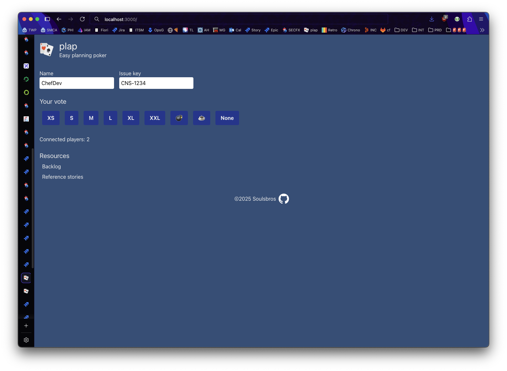
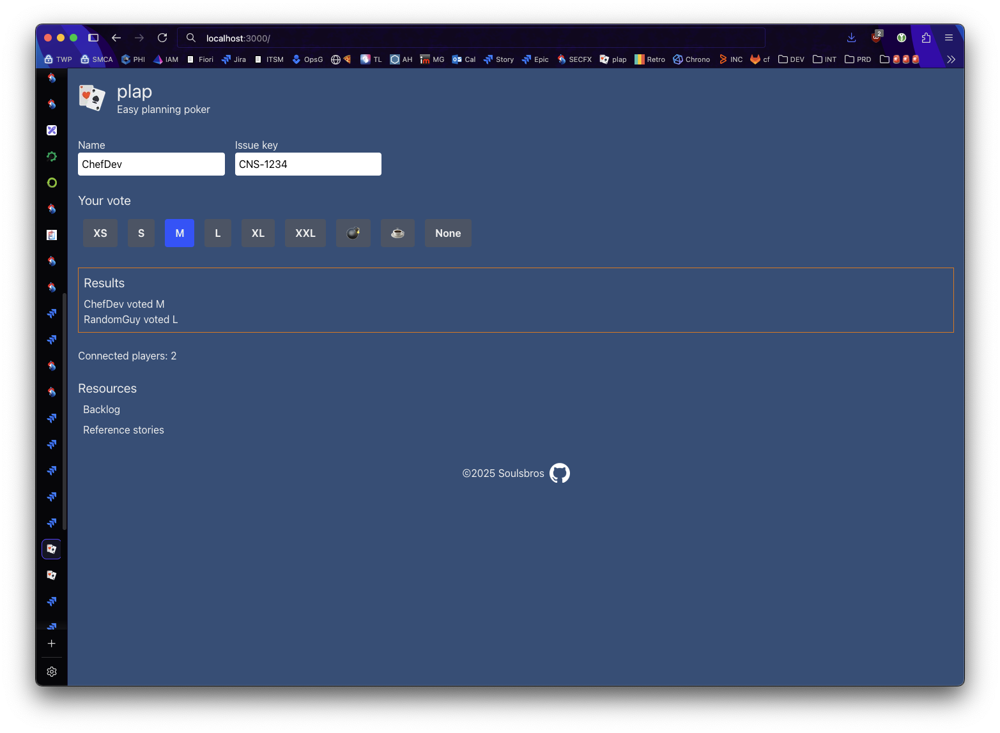

# plap

[](/LICENSE)
[](https://github.com/steeven9/plap/actions/workflows/docker-image.yml)

## ℹ️ Description

plap (short form of planning poker) is a basic and intuitive
[planning poker](https://en.wikipedia.org/wiki/Planning_poker) web
application, to empower your team and smoothen your estimation round.

100% organic and free, grab it and deploy it in your cluster to get started!




The voting results even come with a little surprise if everyone agrees on the
estimation... 😉

## 🏡 Local development

### ⚙️ Prerequisites

- Node.js v22
- Yarn package manager

### 🔧 Installation

```bash
# install dependencies
yarn install

# bootstrap local configuration
cp .env.example .env.local
```

Then adapt the values in the `.env.local` file as needed.

### 🚀 Run locally

```bash
# start frontend
yarn dev
```

Finally, open your browser and head to <http://localhost:3000>.
The first load might take a while, so be patient!

## 📦 Deployment

The application can be easily deployed with Docker. Example manifests are provided
in the `deployment` folder - just make sure to adjust the environment variables.

Please note that rooms or multiple parallel matches are not supported, so make sure
you don't use the same instance with another team at the same time :)

⚠️ NOTE: the Docker container currently runs in development mode. This can expose
sensitive data in the browser console and lead to other shenanigans.

## ♻️ Contributing

If you spot a bug or think there's a missing feature, feel free to open an issue on GitHub!

Before submitting a pull request, please check that the build is still passing even after your changes:

```bash
yarn build
```
